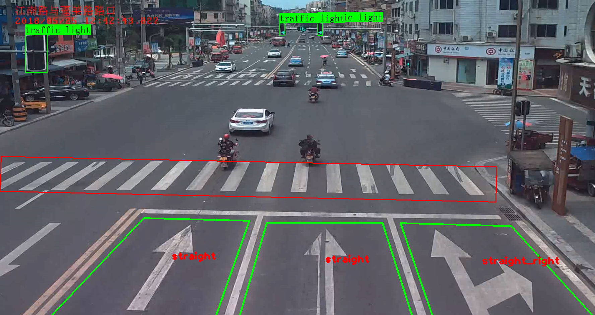
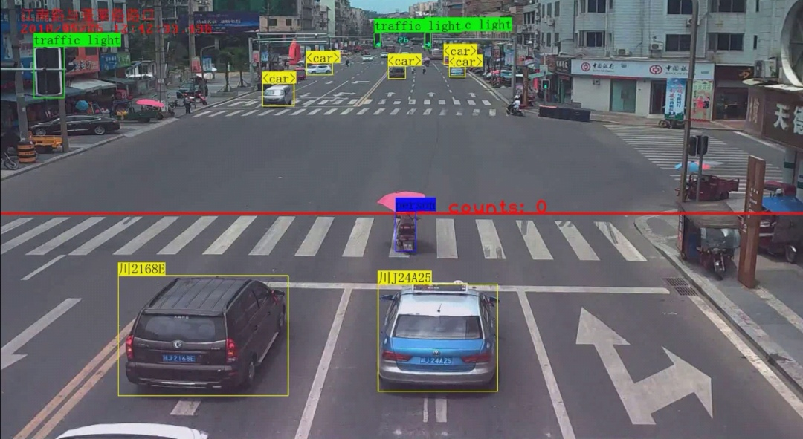

# intelligent transportation system

CV integrated project

# Demo

**Bilibili**:

**Yutube**:

# Build

- Download our pretrained model:
  - **yolo v4** on MS COCO dataset([Google]\[Baidu, code:])
  - **MobileNet** as encoder and **SegNet** as decoder on zebra crossing images download on the Internet([Google]\[Baidu, code:])
  - Other models, such as **DeepSort**’s weight, due to their  small sizes(not exceed Github’s regular file’s size), are already put in our repo.
- In order to run the code for demos, you need to install [ffmpeg](https://www.ffmpeg.org/).

# Basic jobs

### Taffic light & zebra crossing & lane & lane mark

For those jobs, we require user to input static background image of the video, so we can get the environment’s information.

We use **object detection** and **semantic segmentation** method to get the position of traffic light and zebra crossing.

As for the lane and lane mark, we choose to use **traditional cv** method, including connected domain, contour detection, flood fill and similarity calculation, .etc.



### Car tracking & LPR & pedestrians detection

After get the environment information about the videos, we can do further jobs that require time context information of the video.

Before this, we get the position of the traffic light, and when dealing with video, we can **convert the traffic light roi into hsv color space** to get the current color.

And the pedestrians detection is based on newly come up model: **yolo v4**(2020 May). As for the car tracking, we introduce the deep sort algorithm, which is a **tracking model** based on object detecion, so we can reduce our project’s size.



# Combination jobs

# Ackonwledement

Some part of the code is borrowed from the following repo. Thanks for their wonderful works:

1. [ifzhang/FairMOT](https://github.com/ifzhang/FairMOT)  
2. [yehengchen/Object-Detection-and-Tracking](https://github.com/yehengchen/Object-Detection-and-Tracking)
3. [Ma-Dan/keras-yolo4](https://github.com/Ma-Dan/keras-yolo4)
4. [bubbliiing/Semantic-Segmentation](https://github.com/bubbliiiing/Semantic-Segmentation)

# Citation

### YOLO v4:

### SegNet:

### MobileNet:

### Deep_SORT :

```
@inproceedings{Wojke2017simple,
title={Simple Online and Realtime Tracking with a Deep Association Metric},
author={Wojke, Nicolai and Bewley, Alex and Paulus, Dietrich},
booktitle={2017 IEEE International Conference on Image Processing (ICIP)},
year={2017},
pages={3645--3649},
organization={IEEE},
doi={10.1109/ICIP.2017.8296962}
}

@inproceedings{Wojke2018deep,
title={Deep Cosine Metric Learning for Person Re-identification},
author={Wojke, Nicolai and Bewley, Alex},
booktitle={2018 IEEE Winter Conference on Applications of Computer Vision (WACV)},
year={2018},
pages={748--756},
organization={IEEE},
doi={10.1109/WACV.2018.00087}
}
```

# TODO

- [ ] Train the object detection model **on custom dataset**(Car dataset in surveillance scenario:, pedestrian dataset: ).
- [ ] **Prune** and do **quantization** the model to get a higher inference speed.
- [ ] Add **car type classification** part.
- [ ] Add **car speed estimation** part after given the **intrinsic matrix**(actually it can be deduced by 3 VP) and **extrinsic matrix**(Or using Monocular Depth Estimation)

# License

[MIT License](LICENSE)

Copyright (c) 2020 sh-zh-7